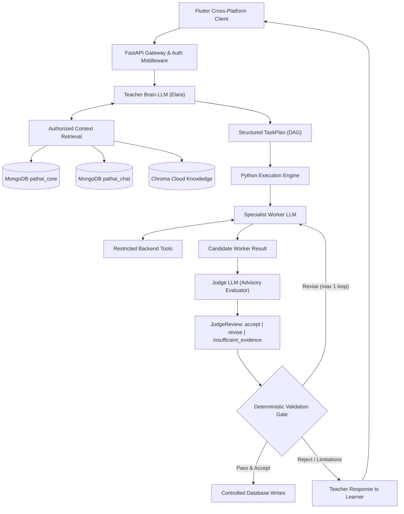

# PathAI (Shiksha) — Complete Agentic Learning System

An enterprise-grade, multi-agent educational platform featuring **Elara (Teacher Brain)**, specialist worker LLMs, advisory **Judge LLM reviews**, deterministic validation gates, and triple-layer persistence (**MongoDB Atlas**, **Chroma Cloud**, and **Redis**).

---

## 1. System Architecture



---

## 2. Core Implementation by Phases

- **Phase 0 — Scaffold:** Typed Pydantic contracts ([TaskPlan](file:///backend/app/core/schemas/plan.py), [WorkerResult](file:///backend/app/core/schemas/worker.py), [JudgeReview](file:///backend/app/core/schemas/judge.py)), DAG acyclicity validation engine, and FastAPI bootstrap.
- **Phase 1 — Foundation:** Managed token authentication, owner-isolated resource scopes, request tracing (`X-Request-Id`), and sanitized public error handling ([ErrorResponse](file:///backend/app/core/errors/models.py)).
- **Phase 2 — Persistence:** MongoDB Atlas collections (`pathai_core` and `pathai_chat`), ACID cross-store coordinator, transactional outbox events, and Chroma Cloud vector passage store.
- **Phase 3 — Teacher Brain:** Elara orchestration loop in [chat_service.py](file:///backend/app/services/chat_service.py) with Google GenAI gateway, structured output generation, and pedagogical fallback.
- **Phase 4 — Capabilities:** Role-scoped database workers ([worker.py](file:///backend/app/db/worker.py)), least-privilege tool grants ([policy.py](file:///backend/app/core/execution/policy.py)), and hybrid passage search.
- **Phase 5 — Quality & Judging:** Advisory Judge LLM evaluation, rubrics, and the 1-bounded correction cycle in [execution_service.py](file:///backend/app/services/execution_service.py).
- **Phase 6 — Reliability & Background:** Idempotent job manager, worker crash leases, outbox processor in [reliability.py](file:///backend/app/db/reliability.py), and document chunking in [chunking.py](file:///backend/app/db/chunking.py).
- **Phase 7 — Learning Platform:** Complete implementation of all 8 specialist workflows: Curriculum, Teaching, Assessment Design, Assessment Evaluation, Code Coaching, Project Mentorship, Adaptation, and Summarization.
- **Phase 8 — Frontend:** Complete cross-platform Flutter application in `frontend/` featuring Elara chat, dynamic roadmap timeline, interactive quizzes with instant rubric feedback, and proposal reviews.
- **Phase 9 — Release:** Production containerization ([Dockerfile](file:///Dockerfile) and [docker-compose.yml](file:///docker-compose.yml)), health checks, CLI management tools, and end-to-end acceptance tests.

---

## 3. Getting Started

### Prerequisites
- Python 3.12+ (or 3.14)
- Flutter 3.44+
- Docker & Docker Compose (optional for containerized deployment)

### Backend Setup

1. **Activate virtual environment & install dependencies:**
   ```bash
   .\.venv\Scripts\activate
   pip install -r requirements.txt
   ```

2. **Configure environment:**
   Create `.env` using `.env.example` as a template:
   ```env
   GOOGLE_API_KEY=your_gemini_api_key
   MONGODB_URI=your_mongodb_atlas_uri
   CHROMA_API_KEY=your_chroma_api_key
   CHROMA_TENANT=your_chroma_tenant_id
   CHROMA_DATABASE=shikshaPathSi
   ```

3. **Verify datastore health:**
   ```bash
   python -c "import sys; sys.path.insert(0, 'backend'); import asyncio; from app.db.manager import DatabaseManager; print(asyncio.run(DatabaseManager.check_health()))"
   ```

4. **Launch the FastAPI server:**
   ```bash
   uvicorn app.main:app --app-dir backend --host 127.0.0.1 --port 8000 --reload
   ```
   Interactive Swagger docs available at: `http://localhost:8000/docs`

### Frontend (Flutter Client) Setup

1. **Navigate to the frontend directory:**
   ```bash
   cd frontend
   ```

2. **Run Flutter static analysis and tests:**
   ```bash
   flutter analyze
   flutter test
   ```

3. **Launch the application:**
   ```bash
   flutter run -d chrome      # Web
   flutter run -d windows     # Windows Desktop
   flutter run                # Android / iOS Emulator
   ```

---

## 4. Test Verification Suite

The repository includes comprehensive automated tests covering every layer of the architecture:

```bash
.\.venv\Scripts\pytest -v backend/tests
```

- **Contracts & Validation:** DAG acyclicity, cyclic dependency rejection, forbidden tool blocking.
- **Authentication & Errors:** Verified token scopes, owner isolation, sanitized error formatting.
- **Model Gateway:** Google GenAI structured output parsing and fallback generation.
- **Database Repositories & ACID:** Deduplication, optimistic concurrency conflicts, isolated rubric storage.
- **Worker & Quality Gates:** Participation vs. mastery separation, Judge LLM revision loops.
- **End-to-End Acceptance:** All Section 16 criteria verified in `test_acceptance_criteria.py`.
- **Flutter Client:** Widget tests verifying the navigation shell and screens in `frontend/test/widget_test.dart`.
