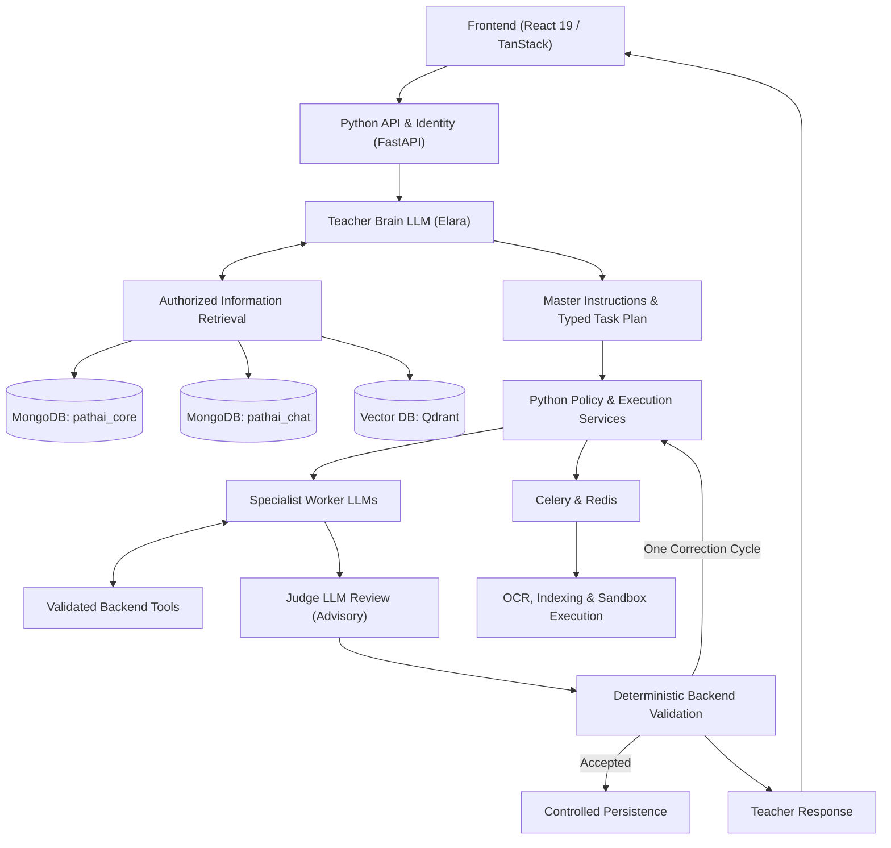

# ShikshaAI (PathAI)

ShikshaAI is an autonomous, agentic personalized learning platform that transforms a learner's goals into a structured, adaptive journey of lessons, continuous assessment, projects, and active review. Tutoring is orchestrated by **Elara (Teacher Brain)** with specialist worker agents and judge verification.

---

## Architecture Overview

ShikshaAI employs an agentic pipeline with strict separation of planning, execution, and deterministic validation:



### Core Tenets
- **Teacher Brain (`Elara`)**: Interprets learner goals, generates master instructions, coordinates context retrieval, and crafts structured task plans.
- **Specialist Workers**: Dedicated agents for curriculum planning, interactive teaching, assessment generation, grading, code coaching, project mentorship, and adaptation.
- **Judge Review & Deterministic Validation**: Advisory evaluation for accuracy, difficulty alignment, and grading rubric conformance. Authoritative persistence is guarded by deterministic backend policy.
- **Evidence-Based Learner Profiling**: Distinguishes lesson participation from demonstrated mastery. Only verified assessments update learner skills.
- **Secure Sandboxed Execution**: Learner code evaluation executes in an isolated environment with resource bounds and no application credentials.

---

## Tech Stack

| Layer | Technology | Primary Role |
|---|---|---|
| **Frontend** | React 19, TanStack Start/Router/Query, Tailwind CSS | Learner experience, streaming chat, voice, and interactive character |
| **API Backend** | Python 3.12+, FastAPI | Authenticated endpoints, SSE streaming, lifecycle management |
| **Contracts** | Pydantic v2 | Strict validation schemas for plans, workers, judges, and tools |
| **Learner Store** | MongoDB (`pathai_core`) | Profiles, roadmaps, skills, evidence, attempts, and proposals |
| **Chat Store** | MongoDB (`pathai_chat`) | Conversations, message history, citations, and summaries |
| **Vector Search** | Qdrant | Authorized passage retrieval and hybrid semantic search |
| **Async Tasks** | Celery + Redis | Document OCR, embedding generation, background indexing |
| **OCR** | PaddleOCR + Native extraction | Text extraction for uploaded notes, PDFs, and learning materials |

---

## Agentic Roles

- **Curriculum Worker**: Prerequisite-aware syllabus planning and versioned roadmap proposals.
- **Teaching Worker**: Scaffolded explanations, real-world analogies, and bite-sized exercises.
- **Assessment Designer**: Creates test questions with hidden evaluation rubrics.
- **Assessment Evaluator**: Grades submissions against secure, server-held rubrics.
- **Code Coach**: Explains programming concepts and debugs code against isolated test executions.
- **Project Mentor**: Reviews project milestones and provides actionable feedback.
- **Adaptation Worker**: Analyzes mastery evidence and proposes personalized remediation plans.
- **Summarization Worker**: Generates source-linked conversation summaries to maintain compact context.

---

## Project Specifications & Documentation

Full architectural specifications and phase definitions are detailed in:
- [PathAI Complete Project Specification](PathAI_Complete_Project.md)

---

## Build Phases

1. **Phase 0 — Scaffold**: Prompts, contracts, Pydantic schemas, and API bootstrapping.
2. **Phase 1 — Foundation**: Authentication, configuration, and security baselines.
3. **Phase 2 — Persistence**: MongoDB schemas, Qdrant collections, and indexing.
4. **Phase 3 — Teacher Brain**: LLM gateway, orchestration policies, and task planning.
5. **Phase 4 — Capabilities**: Retrieval mechanisms, backend tool integration, and worker dispatch.
6. **Phase 5 — Quality**: Judge review loops, schema checks, and deterministic persistence gates.
7. **Phase 6 — Background**: Celery task queue, document OCR, and sandboxed code execution.
8. **Phase 7 — Learning Workflows**: Adaptive roadmaps, lessons, and evidence tracking.
9. **Phase 8 — Frontend Integration**: Real-time streaming, event hooks, and UI state reconciliation.
10. **Phase 9 — Production Release**: Telemetry, evaluations, security auditing, and deployment.

---

## Getting Started

### Prerequisites
- Python 3.12+
- Node.js 20+ & npm / pnpm
- MongoDB & Redis (local or managed instances)
- Qdrant Vector Database

### Backend Setup
```bash
# Clone the repository
git clone https://github.com/amritawasthi04/ShikshaAI.git
cd ShikshaAI

# Set up Python virtual environment
python -m venv .venv
# Activate on Windows:
.venv\Scripts\activate
# Activate on Unix:
source .venv/bin/activate

# Install dependencies (Phase 0 scaffolding)
pip install fastapi uvicorn pydantic celery redis pymongo qdrant-client
```

### Running Development Server
```bash
uvicorn app.main:app --reload --port 8000
```

---

## License

This project is licensed under the MIT License.
