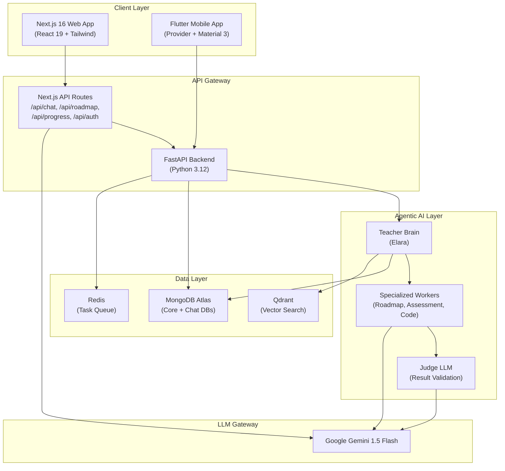

<p align="center">
  
</p>

<h1 align="center">ShikshaAI — Personalized Agentic Learning Platform</h1>

<p align="center">
  <em>Knowledge Builds Brighter Futures</em>
</p>

<p align="center">
  
  
  
  
  
  
  
  
</p>

---

## What is ShikshaAI?

**ShikshaAI** (शिक्षा — "education" in Sanskrit) is an AI-powered personalized learning platform that transforms a learner's career goal into a structured, adaptive journey of lessons, assessments, projects, and real-time tutoring.

The platform combines a multi-agent **Teacher Brain** architecture powered by Google Gemini with personalized roadmap generation, interactive skill assessments, and a conversational AI tutor — all presented through a calm, editorial design language inspired by academic workspaces.

### The Problem

Learners face fragmented resources, generic curricula, and no clear path from "I want to learn X" to actually mastering it. Existing platforms offer courses but not personalized, adaptive learning journeys.

### Our Solution

ShikshaAI provides:

- **AI-generated personalized roadmaps** based on the learner's current skills, experience level, and career target
- **Structured milestone-based learning** with lessons, practice, and assessments
- **Shiksha Bot** — a pedagogical AI tutor backed by the Elara Teacher Brain for real-time concept explanations, study planning, quizzes, and code reviews
- **Progress tracking** with visual metrics, streaks, and mastery indicators
- **Multi-platform access** via a Next.js web app and a Flutter mobile companion

---

## Architecture



The system follows a **multi-agent architecture** where the Teacher Brain (Elara) orchestrates specialized workers for different tasks. The Next.js frontend connects to both the Gemini API directly (for fast chat responses) and the FastAPI backend (for persistent learning state and the full agentic pipeline). The Flutter mobile app communicates with the FastAPI backend for a native mobile experience.

---

## Tech Stack

| Layer | Technology | Purpose |
|:------|:-----------|:--------|
| **Web Frontend** | Next.js 16.4, React 19, TypeScript, Tailwind CSS 4, Framer Motion, GSAP | Landing page, dashboard, learning paths, bot interface |
| **Mobile Frontend** | Flutter 3.12+, Dart, Provider, Material 3 | Cross-platform companion app with chat, roadmap, assessments |
| **Backend API** | Python 3.12, FastAPI, Pydantic v2, Uvicorn | RESTful endpoints, agentic pipeline, auth, execution control |
| **AI / LLM** | Google Gemini 1.5 Flash, Elara Teacher Brain | Personalized tutoring, roadmap generation, assessments |
| **Database** | MongoDB Atlas (Motor async driver) | Learner records (`pathai_core`), conversations (`pathai_chat`) |
| **Vector Search** | Qdrant | Semantic retrieval for context-enriched AI responses |
| **Caching / Queue** | Redis 7 | Background task processing, session caching |
| **DevOps** | Docker, Docker Compose | Containerized deployment with health checks |
| **UI Animation** | Framer Motion, GSAP, custom React components | BlurText, SplitText, CountUp, Magnet, AnimatedContent |

---

## Features

### 🗺️ Personalized Learning Roadmaps
Generate step-by-step learning blueprints customized to your current skill level, known technologies, and career targets. Each roadmap is structured into phases, modules, and individual lessons with estimated time commitments.

### 🤖 Shiksha Bot (AI Tutor)
A pedagogical chatbot powered by the Elara Teacher Brain architecture. The bot provides:
- Concept deep-dives with real-world analogies
- Structured study plans calibrated to your track
- Curated resource recommendations
- Interactive quizzes with instant feedback
- Code review and debugging assistance

The chat system uses a three-tier fallback: **Elara Agentic Engine → Google Gemini Direct → Offline Knowledge Engine**, ensuring the bot always responds.

### 📊 Progress Tracking
Visual mastery metrics, learning streaks, completed milestones, and time-spent analytics. Track your journey from beginner to proficient with clear, honest progress indicators.

### 🧭 Explore & Discover
Browse a curated library of 50+ roadmaps spanning Full-Stack Web Engineering, Data Structures & Algorithms, Machine Learning, DevOps, System Design, and more. Each roadmap includes difficulty levels, duration estimates, and module counts.

### 📝 Practice & Assessments
Hands-on checkpoints and quizzes to validate understanding before advancing. The assessment service generates questions aligned with your current lesson and skill level.

### 👤 Learner Profile & Settings
Manage your learning preferences, active roadmaps, completed milestones, and account settings. Dark/light theme support with a warm, editorial design system.

### 📱 Flutter Mobile Companion
A cross-platform mobile app with bottom navigation for Elara Tutor, Roadmap, Assessments, Proposals, and Profile screens — built with Provider state management and Google Fonts.

### 🐳 Docker-Ready Deployment
Multi-stage Docker build and Docker Compose configuration with Redis health checks for production-ready containerized deployment.

---

## Project Structure

```
ShikshaAI/
├── src/                          # Next.js Web Application
│   ├── app/                      # App Router pages
│   │   ├── api/                  # API routes (chat, roadmap, progress, auth, skills)
│   │   ├── build-path/           # Roadmap builder wizard
│   │   ├── dashboard/            # Learning dashboard
│   │   ├── explore/              # Browse roadmaps & resources
│   │   ├── learning-path/        # Active learning path view
│   │   ├── progress/             # Progress tracking
│   │   ├── shiksha-bot/          # AI tutor chat interface
│   │   ├── signin/ & signup/     # Authentication pages
│   │   ├── profile/ & settings/  # User management
│   │   └── page.tsx              # Landing page
│   ├── components/               # React components
│   │   ├── layout/               # AppLayout, AppNavbar, AppSidebar
│   │   ├── effects/              # EditorialHeadline, PageTransition
│   │   ├── explore/              # ResourceDetailModal
│   │   ├── learning/             # LessonDetailModal
│   │   └── reactbits/            # AnimatedContent, BlurText, SplitText, CountUp, Magnet
│   ├── services/                 # authService, roadmapGenerator, roadmapService, themeService
│   ├── data/                     # exploreResources catalog
│   └── types/                    # TypeScript type definitions
│
├── backend/                      # FastAPI Python Backend
│   ├── app/
│   │   ├── api/v1/routes/        # health, learners, roadmaps, skills, chat, proposals, etc.
│   │   ├── core/
│   │   │   ├── prompts/          # teacher.py, worker.py, judge.py (Agent system prompts)
│   │   │   ├── schemas/          # Pydantic models (api, chat, domain, plan, skills, worker)
│   │   │   ├── curriculum/       # canonical_roadmaps.py, skill_taxonomy.py
│   │   │   ├── llm/              # gateway.py (LLM provider abstraction)
│   │   │   ├── execution/        # policy.py, validator.py (Safe execution control)
│   │   │   ├── errors/           # Exception handling
│   │   │   └── auth/             # Authentication deps, models, token management
│   │   ├── db/                   # MongoDB connection, repositories, models, migrations
│   │   ├── services/             # Business logic (chat, roadmap, assessment, learner, etc.)
│   │   └── middleware/           # Request context tracing
│   └── tests/                    # 15+ test modules (API, agentic pipeline, acceptance, etc.)
│
├── frontend/                     # Flutter Mobile Companion App
│   ├── lib/
│   │   ├── screens/              # ChatScreen, RoadmapScreen, AssessmentsScreen, etc.
│   │   ├── providers/            # AppState (Provider state management)
│   │   ├── services/             # api_service.dart (Backend communication)
│   │   └── theme/                # app_theme.dart (Material 3 theming)
│   └── pubspec.yaml              # Flutter dependencies
│
├── public/                       # Static assets (images, SVGs)
├── .agents/rules/                # AI agent rule configurations
├── Dockerfile                    # Multi-stage production container
├── docker-compose.yml            # Full stack orchestration (API + Redis)
├── requirements.txt              # Python dependencies
├── package.json                  # Node.js dependencies
└── .env.example                  # Environment variables template
```

---

## Getting Started

### Prerequisites

- **Node.js** 18+ and npm
- **Python** 3.12+
- **Flutter** 3.12+ (for mobile app)
- **Docker** & Docker Compose (optional, for containerized deployment)
- **MongoDB Atlas** account (or local MongoDB)
- **Google Gemini API Key** ([Get one here](https://ai.google.dev/))

### 1. Clone the Repository

```bash
git clone https://github.com/amritawasthi04/ShikshaAI.git
cd ShikshaAI
```

### 2. Environment Setup

```bash
cp .env.example .env
```

Edit `.env` and fill in your credentials:

```env
GOOGLE_API_KEY=your_gemini_api_key
GEMINI_API_KEY=your_gemini_api_key
MONGODB_URI=mongodb+srv://<username>:<password>@cluster.mongodb.net/...
```

### 3. Run the Next.js Web App

```bash
npm install
npm run dev
```

The web app will be available at `http://localhost:3000`.

### 4. Run the FastAPI Backend

```bash
python -m venv .venv
# Windows
.venv\Scripts\activate
# macOS/Linux
source .venv/bin/activate

pip install -r requirements.txt
uvicorn backend.app.main:app --reload --port 8000
```

API docs available at `http://localhost:8000/docs`.

### 5. Run the Flutter Mobile App

```bash
cd frontend
flutter pub get
flutter run
```

### 6. Docker Deployment (Alternative)

```bash
docker-compose up --build
```

This launches the FastAPI backend on port `8000` and Redis on port `6379` with health checks.

---

## API Endpoints

| Method | Endpoint | Description |
|:-------|:---------|:------------|
| `POST` | `/api/chat` | Send a message to Shiksha Bot (Elara Teacher Brain → Gemini fallback) |
| `POST` | `/api/roadmap` | Generate a personalized learning roadmap |
| `GET` | `/api/roadmap` | Retrieve active roadmap for current learner |
| `GET` | `/api/progress` | Fetch learner progress metrics |
| `POST` | `/api/auth` | Authenticate learner (sign in / sign up) |
| `GET` | `/api/skills/categories` | List available skill categories and taxonomy |
| `GET` | `/api/v1/healthz` | Backend health check |
| `GET` | `/api/v1/roadmaps/active` | Get active roadmap from backend |
| `POST` | `/api/v1/conversations` | Create a new tutoring conversation |
| `POST` | `/api/v1/conversations/:id/messages` | Send message to Teacher Brain |

---

## Team

Built with ❤️ for hackathon submission.

**Team ShikshaAI**

- [Amrit Awasthi](https://github.com/amritawasthi04) — Full-Stack Developer & AI Engineer

---

## License

This project is built for educational and hackathon purposes.

MIT License — see [LICENSE](LICENSE) for details.

---

<p align="center">
  <strong>ShikshaAI</strong> — <em>Because every learner deserves a personalized path.</em>
</p>
